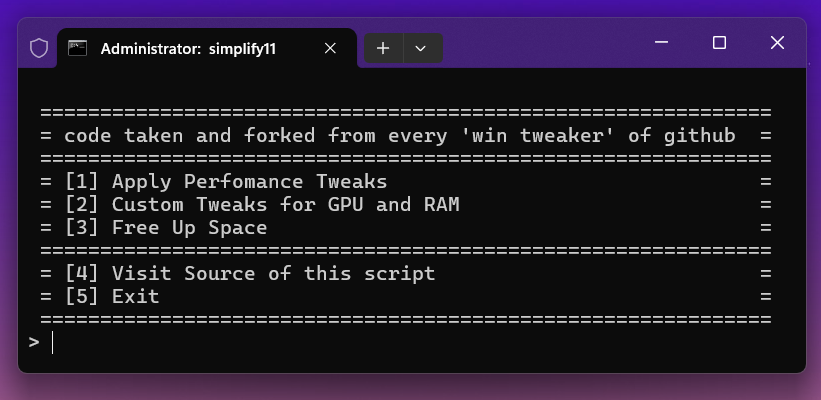

# Simplify11 ⚡

**Must-Have Tweaks for Performance & Privacy with Space Cleaner 🔒**



### Launch Command: (PowerShell)

```powershell
iwr "https://dub.sh/simplify11" | iex
```

---

## Key Features:

🖱️ **Mouse & Keyboard:**

- Adjusts mouse speed and thresholds for better responsiveness.

🎮 **GPU:**

- Enables hardware-accelerated scheduling and disables unnecessary preemption to boost graphics performance.

🌐 **Network & CPU:**

- Optimizes network settings to reduce latency and improve data handling.
- Disables power-saving features to ensure maximum CPU performance.

⚡ **Power & Memory:**

- Activates a hidden high-performance power plan to enhance responsiveness.
- Allocates more RAM for applications and disables paging to reduce microstuttering.
- Turns off prefetching and superfetching to streamline memory usage.

🚀 **Startup Optimization:**

- Modifies boot settings to speed up startup time and improve system responsiveness right after booting.

🧹 **Cleanup and Space Management:**

- Disables reserved storage and removes virtual memory to free up disk space.
- Cleans up the Windows Update folder to reclaim storage and boost efficiency.

🔧 **Customizable Options:**

- Allows users to choose specific tweaks based on their hardware (RAM size and GPU type) for tailored optimization.

---

## Integrations 🌟

- [**Winutil 🚀**](https://github.com/ChrisTitusTech/winutil): Install Programs, Tweaks, Fixes, and Updates
- [**Privacy.sexy 🔒**](https://privacy.sexy): Open-source tool for enhancing privacy & security

---

## Sources

The following projects and resources have inspired and contributed to the development of Simplify11:

- [**Win11Tweaks**](https://github.com/SysadminWorld/Win11Tweaks) - My first batch, used as a starting point
- [**Windows 10 Latency Optimization**](https://github.com/denis-g/windows10-latency-optimization) - Has most accurate tweaks

Additional insights and techniques were derived from these projects:

- [**QuickBoost**](https://github.com/SanGraphic/QuickBoost)
- [**CoutX**](https://github.com/UnLovedCookie/CoutX)
- [**SyncOS**](https://github.com/Snowfliger/SyncOS)
- [**Win10Boost**](https://github.com/rahilpathan/Win10Boost)
- [**Ancel's Performance Batch**](https://github.com/ancel1x/Ancels-Performance-Batch)
